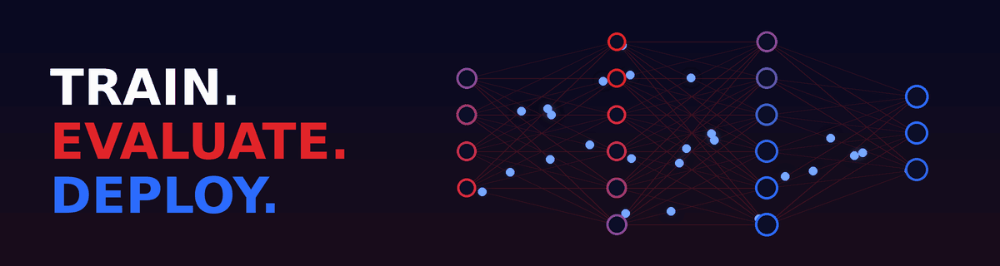
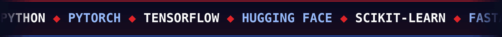

<!-- =========================================================================
     🕸️ SPIDER-MAN HUD // MOHD SHAMI — AI & MACHINE LEARNING ENGINEER
     ========================================================================= -->

  

  <!-- DYNAMIC WEB-SLINGER TYPING HUD -->
  

  

    <strong>Weaving intelligent, end-to-end Machine Learning systems from raw telemetry to low-latency production.</strong>
  

  <!-- MULTIVERSE QUICK-NAV RADAR BADGES -->
  

    
    
    
    
    
    
    
  

## 🕷️ The Origin Story

> *"The only true wisdom is in knowing you know nothing — but with great compute comes great responsibility."*

Just like navigating the sprawling web of the multiverse, I specialize in taming high-dimensional complexity and turning raw algorithms into **dependable, production-ready AI products**. My work spans the complete lifecycle: rigorous data preprocessing, model architecture design, zero-leakage evaluation, low-latency API engineering, and containerized deployment.

Whether it's orchestrating enterprise agent swarms (**AgentOps**), diagnosing medical risks with multimodal vision and language (**Revive**), diagnosing agricultural pathology for smallholder farmers (**FarmAIQ**), or decoding econometric telemetry across 643 Indian districts (**BharatLens**), I engineer systems built to survive the unpredictable forces of the real world.

  

## 🕸️ Spider-Sense & Core Domains

<table width="100%">
  <tr>
    <td width="50%" valign="top">
      <h3>🤖 Agentic AI &amp; LLM Systems</h3>
      <ul>
        <li>Autonomous multi-agent orchestration, dynamic tool routing, and recursive reasoning swarms.</li>
        <li>Parameter-Efficient Fine-Tuning (PEFT, LoRA/QLoRA) and high-throughput inference serving.</li>
        <li>Production RAG pipelines with vector stores (vLLM, Qdrant, FAISS) and semantic memory caching.</li>
      </ul>
    </td>
    <td width="50%" valign="top">
      <h3>👁️ Deep Learning &amp; Computer Vision</h3>
      <ul>
        <li>Convolutional and vision transformer architectures for automated image pathology and segmentation.</li>
        <li>Real-time webcam telemetry, facial landmark detection, and temporal drowsiness/distraction tracking.</li>
        <li>Multimodal clinical diagnostic architectures and risk stratification.</li>
      </ul>
    </td>
  </tr>
  <tr>
    <td width="50%" valign="top">
      <h3>⚡ Applied ML &amp; Econometrics</h3>
      <ul>
        <li>Classification, survival analysis, and customer retention systems (ChurnShield AI, HamOrSpam).</li>
        <li>District-level panel microdata modeling, velocity forecasting, and anomaly detection.</li>
        <li>Interpretable, Explainable AI using SHAP values and feature attribution graphs.</li>
      </ul>
    </td>
    <td width="50%" valign="top">
      <h3>🚀 Production Engineering &amp; MLOps</h3>
      <ul>
        <li>High-concurrency microservice design using FastAPI, Flask, and asynchronous REST APIs.</li>
        <li>Docker containerization, reproducible execution pipelines, and experiment tracking (MLflow, W&amp;B).</li>
        <li>Algorithmic agility: 850+ DSA problems solved across dynamic programming, trees, and graphs.</li>
      </ul>
    </td>
  </tr>
</table>

## 🏙️ Multiverse Operations &amp; Featured Missions

| Mission | Domain | Description | Arsenal |
| :--- | :--- | :--- | :--- |
| **[AgentOps](https://github.com/mohdshamii/agentops)** | `Agentic AI` | Enterprise-grade agentic platform for multi-step reasoning, autonomous workflows, and dynamic tool execution with LLaMA 3.2, Mistral 7B, Qwen 2.5 Coder, and DeepSeek R1. | `FastAPI` · `vLLM` · `Qdrant` · `Docker` |
| **[Revive](https://github.com/mohdshamii/Revive)** | `Healthcare ML` | Multimodal machine learning &amp; deep learning diagnostic platform for automated clinical risk stratification. | `PyTorch` · `Computer Vision` · `NLP` · `Flask` |
| **[FarmAIQ](https://github.com/mohdshamii/FarmAIQ)** | `AgriTech CV` | Enterprise-grade precision agriculture decision platform bridging deep CV crop pathology with field husbandry for Indian smallholders. | `TensorFlow` · `OpenCV` · `Python` · `REST API` |
| **[BharatLens](https://github.com/mohdshamii/BharatLens)** | `Econometrics` | District-level econometric &amp; ML platform processing panel microdata across 643 Indian districts with SHAP explainability and growth momentum forecasting. | `Scikit-learn` · `SHAP` · `Polars` · `Streamlit` |
| **[100](https://github.com/mohdshamii/100)** | `Curriculum` | Complete, self-contained AI/ML engineering curriculum: 100 papers, 100 books, 100 datasets, 100 tools, 100 interview questions, and formula cheatsheets. | `Research` · `Roadmaps` · `Architecture` |
| **[DSAos &amp; PyDSA](https://github.com/mohdshamii/PyDSA)** | `Algorithmic Engine` | Adaptive AI-driven DSA platform + comprehensive repository of 850+ curated data structure and algorithmic challenges solved in Python &amp; SQL. | `Python` · `Algorithms` · `LeetCode` · `Data Structures` |
| **[HydroRaksh](https://github.com/mohdshamii/HydroRaksh)** | `Geospatial AI` | Production-grade geospatial water intelligence platform aggregating live reservoir, groundwater, and rainfall telemetry across India. | `Geospatial APIs` · `Python` · `Telemetry` |
| **[ChurnShield AI](https://github.com/mohdshamii/ChurnShield_AI)** | `Enterprise ML` | Predictive customer churn risk modeling and automated retention strategy generator with interactive telemetry dashboard. | `XGBoost` · `Scikit-Learn` · `Streamlit` |

## 🛠️ The Stark Tech Web Arsenal

  

<table width="100%">
  <tr>
    <td width="22%"><strong>Core Languages</strong></td>
    <td>
      
      
      
      
      
    </td>
  </tr>
  <tr>
    <td><strong>Modeling &amp; Deep Learning</strong></td>
    <td>
      
      
      
      
      
      
    </td>
  </tr>
  <tr>
    <td><strong>LLM &amp; Agentic Systems</strong></td>
    <td>
      
      
      
      
      
      
    </td>
  </tr>
  <tr>
    <td><strong>Data &amp; Computer Vision</strong></td>
    <td>
      
      
      
      
      
      
    </td>
  </tr>
  <tr>
    <td><strong>Serving &amp; Production</strong></td>
    <td>
      
      
      
      
      
      
      
      
    </td>
  </tr>
</table>

## 📊 Spider-Sense Live Telemetry

  
<em>"With great code comes great responsibility."</em>

  <table border="0" width="100%">
    <tr>
      <td width="50%" align="center">
        
      </td>
      <td width="50%" align="center">
        
      </td>
    </tr>
    <tr>
      <td width="50%" align="center">
        
      </td>
      <td width="50%" align="center">
        
      </td>
    </tr>
  </table>

## 🕸️ The Peter Parker Engineering Principles

- 🕷️ **With great data comes great responsibility.** Never evaluate on test leakage. Select metrics that fit the business problem (ROC-AUC, Precision@K, F1), not vanity accuracy.
- ⚡ **Build for the battlefield, not the notebook.** Wrap models in clean REST APIs, validate schemas with Pydantic, containerize with Docker, and monitor for data drift.
- 🎯 **No black boxes without explainability.** Pair complex models with SHAP/LIME feature attribution so stakeholders understand why predictions are made.
- 🧩 **Agile, robust, and low-latency.** Keep inference budgets lean, prioritize vectorized computation, and favor maintainable architecture over fragile complexity.

## 📡 Fire the Web-Signal // Get In Touch

Whether you want to discuss **Applied ML, Agentic Architectures, Production Systems**, or explore exciting opportunities, my frequency is always open:

  

    
    
    
  

  

    
    &nbsp;·&nbsp;
    
    &nbsp;·&nbsp;
    
    &nbsp;·&nbsp;
    
  

 

  

